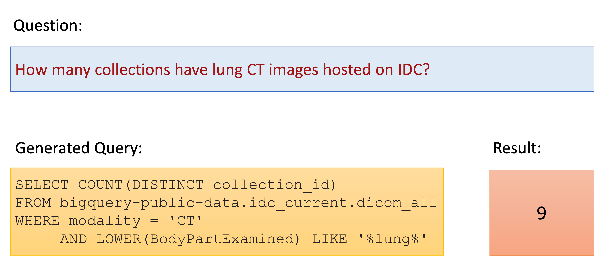
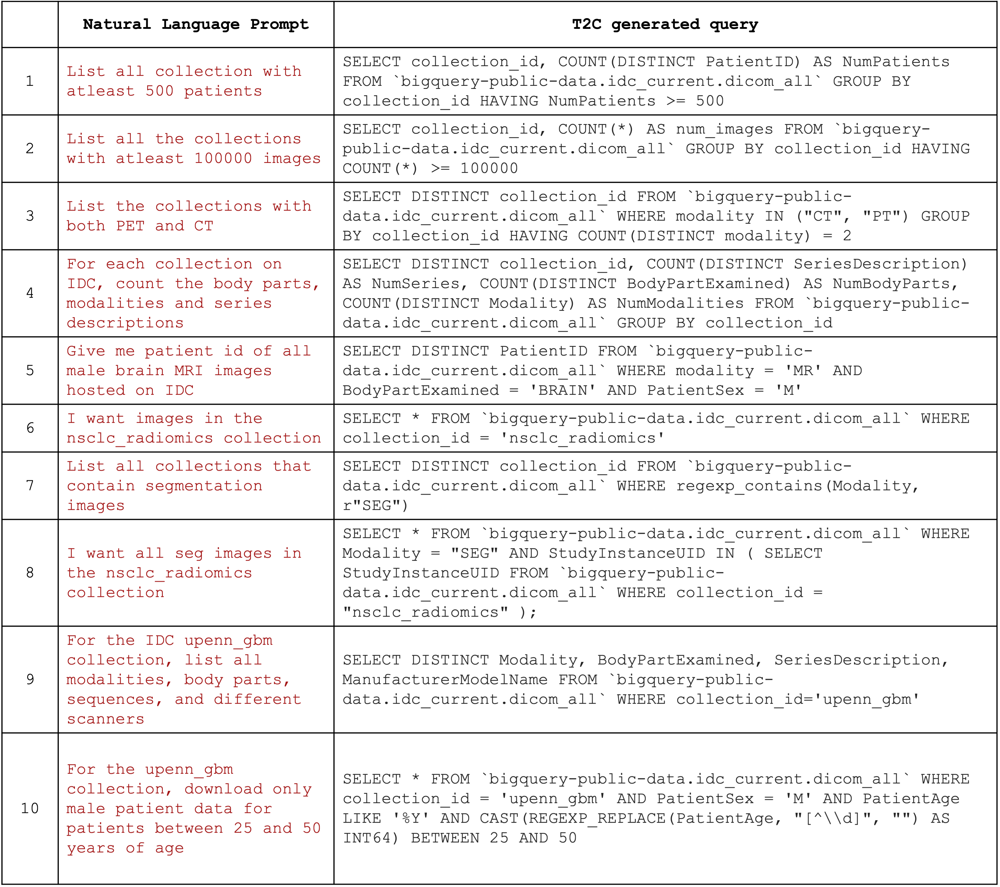

# Text2Cohort
This work presents Text2Cohort - a revolutionary new toolkit that allows users to interact with the imaging data commons (IDC) using natural language! With Text2Cohort, you can easily extract information or discover cohorts without having to use complicated bigquery scripts. Simply ask a query like “download all male brain MRIs for patients under the age of 25 across all relevant IDC collections” and Text2Cohort will handle the rest! Here is an example:

<p align="center">

</p>

## Text2Cohort Framework

<p align="center">

</p>

## Results
<!-- <p align="center">

</p> -->

|    | **Natural Language User Input**                                                                                          | **Text2Cohort Generated Query**                                                                                                                                                                                                                                                                                                                                                                                                                                                                                              |
| -- | ------------------------------------------------------------------------------------------------------------------------ | ---------------------------------------------------------------------------------------------------------------------------------------------------------------------------------------------------------------------------------------------------------------------------------------------------------------------------------------------------------------------------------------------------------------------------------------------------------------------------------------------------------------------------- |
| 1  | How many different body parts and modalities are hosted on IDC?                                                          | SELECT COUNT(DISTINCT BodyPartExamined) as num_body_parts, COUNT(DISTINCT Modality) as num_modalities FROM bigquery-public-data.idc_current.dicom_all                                                                                                                                                                                                                                                                                                                                                                        |
| 2  | How many patients are on IDC?                                                                                            | SELECT COUNT(DISTINCT PatientID) AS num_patients FROM \`bigquery-public-data.idc_current.dicom_all\`                                                                                                                                                                                                                                                                                                                                                                                                                         |
| 3  | How many male brain MRIs are hosted on IDC where the patient is older than 25 and acquired after 2005?                   | SELECT COUNT(\*) as num_of_scans FROM \`bigquery-public-data.idc_current.dicom_all\` WHERE Modality = 'MR' AND BodyPartExamined = 'BRAIN' AND PatientSex = 'M' AND CAST(REGEXP_EXTRACT(PatientAge, r'\\d+') AS INT64) > 25 AND CAST(EXTRACT(YEAR FROM StudyDate) AS INT64) > 2005                                                                                                                                                                                                                                            |
| 4  | For the upenn_gbm collection, how many male and female patients?                                                         | SELECT PatientSex, COUNT(DISTINCT PatientID) FROM bigquery-public-data.idc_current.dicom_all WHERE collection_id = 'upenn_gbm' GROUP BY PatientSex                                                                                                                                                                                                                                                                                                                                                                           |
| 5  | For the upenn_gbm collection, how many patients under the age of 25 years, between 25 and 50, and greater than 50 years? | SELECT CASE WHEN CAST(REGEXP_REPLACE(PatientAge, r'[^0-9]', '') AS INT64) < 25 THEN 'under_25' WHEN CAST(REGEXP_REPLACE(PatientAge, r'[^0-9]', '') AS INT64) >= 25 AND CAST(REGEXP_REPLACE(PatientAge, r'[^0-9]', '') AS INT64) <=50 THEN '25_to_50' WHEN CAST(REGEXP_REPLACE(PatientAge, r'[^0-9]', '') AS INT64) > 50 THEN 'over_50' ELSE 'unknown_age' END AS age_group, COUNT(DISTINCT PatientID) AS num_patients FROM \`bigquery-public-data.idc_current.dicom_all\` WHERE collection_id='upenn_gbm' GROUP BY age_group |
| 6  | List all collection with at least 500 patients                                                                           | SELECT collection_id, COUNT(DISTINCT PatientID) AS NumPatients FROM \`bigquery-public-data.idc_current.dicom_all\` GROUP BY collection_id HAVING NumPatients >= 500                                                                                                                                                                                                                                                                                                                                                          |
| 7  | List all the collections with at least 100000 images                                                                     | SELECT collection_id, COUNT(\*) AS num_images FROM \`bigquery-public-data.idc_current.dicom_all\` GROUP BY collection_id HAVING COUNT(\*) >= 100000                                                                                                                                                                                                                                                                                                                                                                          |
| 8  | List the collections with both PET and CT                                                                                | SELECT DISTINCT collection_id FROM \`bigquery-public-data.idc_current.dicom_all\` WHERE modality IN ("CT", "PT") GROUP BY collection_id HAVING COUNT(DISTINCT modality) = 2                                                                                                                                                                                                                                                                                                                                                  |
| 9  | For each collection on IDC, count the body parts, modalities, and series descriptions                                    | SELECT DISTINCT collection_id, COUNT(DISTINCT SeriesDescription) AS NumSeries, COUNT(DISTINCT BodyPartExamined) AS NumBodyParts, COUNT(DISTINCT Modality) AS NumModalities FROM \`bigquery-public-data.idc_current.dicom_all\` GROUP BY collection_id                                                                                                                                                                                                                                                                        |
| 10 | For the upenn_gbm collection, download only male patient data for patients between 25 and 50 years of age                | SELECT \* FROM \`bigquery-public-data.idc_current.dicom_all\` WHERE collection_id = 'upenn_gbm' AND PatientSex = 'M' AND PatientAge LIKE '%Y' AND CAST(REGEXP_REPLACE(PatientAge, "[^\\\\d]", "") AS INT64) BETWEEN 25 AND 50                                                                                                                                                                                                                                                                                                |

## Usage
We have shared a jupyter notebook to help anyone get started with using text2cohort. Add your OpenAI API key and get started with natural language queries. Here is an example query that can be run using Text2Cohort

```python
df = text2cohort("download all male brain MRIs for patients under the age of 25 across all relevant IDC collections")
```
This will return the result of the query as a pandas dataframe.

### Citation 
To cite this work:

```text

```
