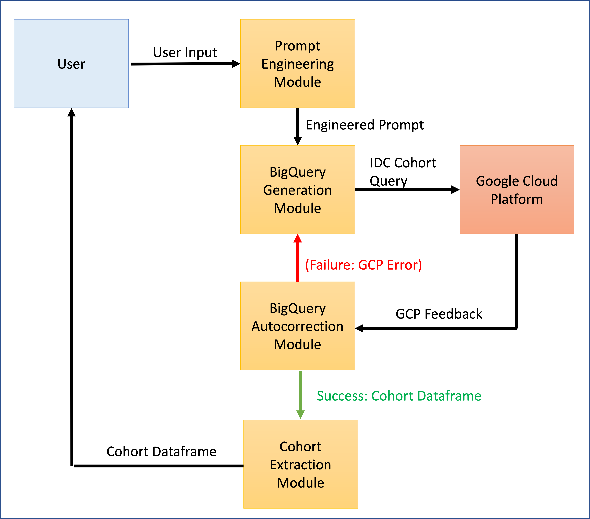
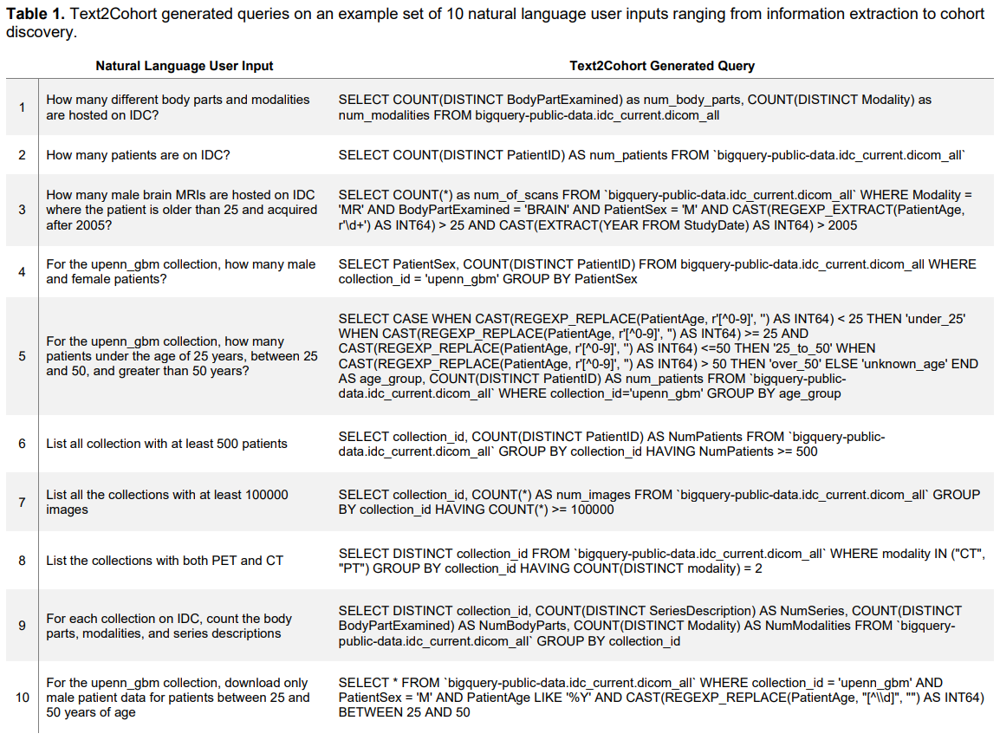
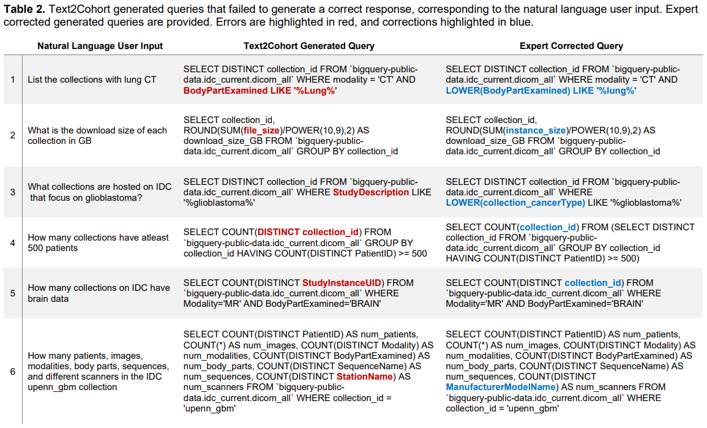

# Text2Cohort

## Text2Cohort: Democratizing the NCI Imaging Data Commons with Natural Language Cohort Discovery

### Pranav Kulkarni, Adway Kanhere, Paul H. Yi, Vishwa S. Parekh

In this work, we present Text2Cohort - a new toolkit that will revolutionize how researchers can discover cohorts, interact, and access cancer imaging data hosted on the NCI Imaging Data Commons (IDC) with natural language. With Text2Cohort, you can easily extract information or discover cohorts without having to use complicated BigQuery scripts. Simply ask a query like "Download all male brain MRIs for patients under the age of 25 across all relevant IDC collections” and Text2Cohort will handle the rest! Here is an example:

<p align="center">

</p>

You can read our paper on Text2Cohort [here](https://arxiv.org/abs/2305.07637)!

### Citation

To cite this work, please use this bibtex citation:

```text
@article{kulkarni2023text,
  title={Text2Cohort: Democratizing the NCI Imaging Data Commons with Natural Language Cohort Discovery},
  author={Kulkarni, Pranav and Kanhere, Adway and Yi, Paul H and Parekh, Vishwa S},
  journal={arXiv preprint arXiv:2305.07637},
  year={2023},
  month={May}
}
```

## Text2Cohort Framework

We developed Text2Cohort, a LLM based toolkit to facilitate cohort curation by interpreting natural language queries. By using natural language to query data, Text2Cohort enables researchers to interact with and discover cohorts from multiple collections simultaneously in a more intuitive and user-friendly way, thus eliminating the learning curve associated with current solutions. The Text2Cohort toolkit is built using GPT-3.5, the state-of-the-art language model that also powers ChatGPT, and consists of four major components: (1) prompt engineering, (2) BigQuery generation, (3) BigQuery autocorrection, and (4) cohort extraction, as illustrated below.

<p align="center">

</p>

Text2Cohort successfully generated queries and their responses with an 88% accuracy and F1 score of 0.94. However, it failed to generate queries for 6 out of 50 (12%) user inputs due to syntax and semantic errors. Text2Cohort succeeded at generating queries with correct responses, but occasionally failed due to a lack of understanding of the data schema. Despite these shortcomings, our results indicate that Text2Cohort always generates queries with correct structure and any queries with syntax or semantic errors can be corrected by an expert with minimal character-edits. 





## Usage

We have shared a [Python notebook](./text2cohort.ipynb) with the Text2Cohort implementation. Add your OpenAI API private key and get started with natural language queries! Here is an example query that can be run using Text2Cohort to yield a pandas dataframe response:

```python
df = text2cohort("download all male brain MRIs for patients under the age of 25 across all relevant IDC collections")
```

### Rate Limits

Due to rate limits, Text2Cohort may fail to run. Before running Text2Cohort, set the `openai_rpm` variable to your current rate limit. This will force the toolkit to sleep before executing the next API request. Please refer to [OpenAI Rate Limits](https://platform.openai.com/docs/guides/rate-limits/overview) for more information.

## Dataset Access

The complete list of 50 natural language user inputs curated for this work, along with their Text2Cohort generated queries is publicly available to view in the supplementary material of our paper [here](https://arxiv.org/abs/2305.07637) and the csv version is available on this repository [here](./data/T2C_UM2ii_Text-Query.csv). The dataset is available as a Python pickle file containing a dictionary mapping each natural language user input to a list containing its corresponding generated query and response [here](https://drive.google.com/file/d/1BQHuuQNW1l2HAoD6spLNCjI80c6_GHX_/view). Please note that the pickle file for query #41 is omitted from the list due to it’s large file size (~131 GB). We request users to run the query directly in BigQuery if they want to see the output. 

## Disclaimer

For our study, we accessed GPT-3.5 in April 2023. Due to the ever-changing nature of language models, our code may not be compatible with future versions of GPT and OpenAI's APIs. 
